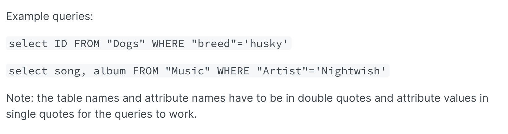

# Policy evaluation logic

How are IAM policies evaluated?&#x20;

* By default, all requests are implicitly denied (with the exception of the AWS account root user, which has full access)&#x20;
* An explicit allow in an identity-based or resource-based policy overrides this default.
* If a permissions boundary, Organizations SCP, or session policy is present, it might override the allow with an implicit deny.
* An explicit deny in any policy overrides any allows.

You can see the order in which policies are evaluated:

* SCP
* Resource-based policy
* Identity-based policy
* IAM permissions boundary
* Session policy.&#x20;
